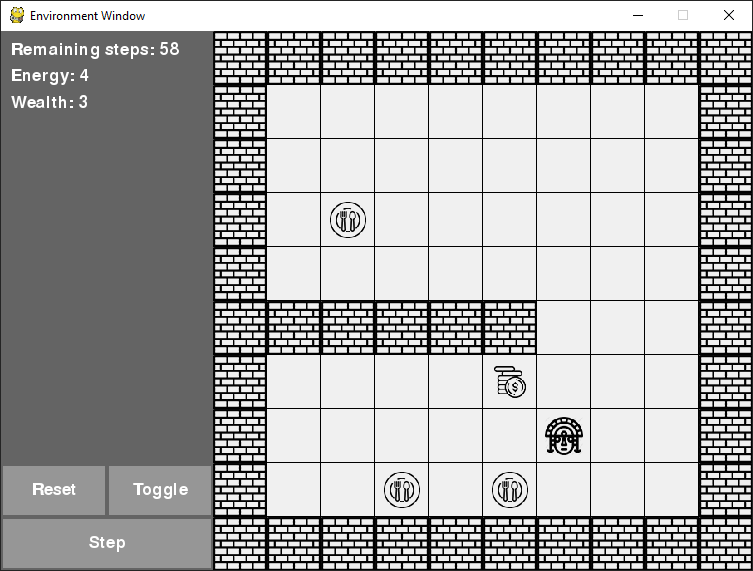

# Reinforcement learning
This is a custom environment based on OpenAI Gym interface and rendered in Pygame. You can use this environment to effortlessly test OpenAI Baselines (or Stable Baselines) implementations of reinforcement learning algorithms.

The environment is a grid world with a single agent. The agent's aim is to collect as many resources as possible in its limited lifespan. You can customize this even more: change observation space, action space, rewards, etc.

## Prerequisites
To be able to run `run.py`, install Stable Baselines package: `pip install stable-baselines`. This should also install other required packages such as NumPy and OpenAI Gym if you don't already have them. You'll also need to install Pygame: `pip install pygame`.
